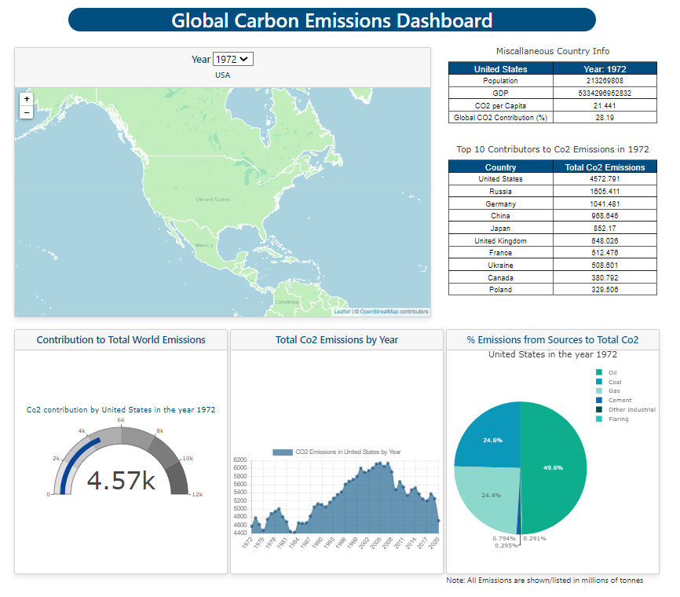

### Project 3 University of Minnesota Data Visualization and Analytics Boot Camp
# World CO2 Emissions Dashboard:

Created by Group 5 

Project Team Members: Ben Johnson, Joey Eikens, Yameena Khan, Zach Wood & Oscar Iwu
____________
## About 
The purpose of the app we have created is to present information on the carbon dioxide emissions by each country on the world map. Our dashboard presents information from years 1972 to 2020.
By clicking on a country on the world map and selecting a year from the dropdown, users can use our dashboard to observe the following information for a selected country, for a chosen year:
- population, country's GDP, CO2 per capita and country's global CO2 contribution
- top 10 contributors in global emissions in a given year
- % contribution to the world's CO2 in a particular year
- total CO2 per year
- a % breakup of CO2 contributions by different sources (coal, oil, gas, cement)

  

____________
## Technologies and Tools Used:

- PostgreSQL
- Jupyter Notebook/Pandas
- Flask 
- Bootstrap
- Charts.js
- Leaflet.js
- Plotly.js

_____________
## Contents of the Repo:

- app.py
- co2_ETL.ipynb
- world-co2-omissions.sql
- templates
  - index.html
- static
  - css
    - style.css
  - data
    - countries1.geojson
  - js
    - logic.js
    - scatter_plot.js
    - year_dropdown.js

_____________
## Instructions on how to use our Dashboard:

1. Clone the repo to your machine
1. Open the pgAdmin app on your machine
1. Create a new database called ``world_carbon_emissions_db`` 
1. Open the query tool within the ``world_carbon_emissions_db`` 
1. Open the ``world-co2-omissions.sql`` file stored in the repo cloned within PostgreSQL
1. Highlight the code to create tables for the ``world_co2``
1. Once the table is created right click on the local repo and then launch a Git Bash (Windows) or Terminal (Mac)
1. Type ``source activate PythonData38`` and then click ``enter`` to activate PythonData38 environment 
1. Launch Jupyter Notebooks in Google Chrome, by typing the command ``jupyter notebook`` on your Gitbash/Terminal window and then click ``enter``
1. Open the ``co2_ETL.ipynb``
1. Run all the cells peforming the ETL process
1. After that close the Jupyter Notebooks and exit the Gitbash/Terminal window
1. Navigate back to the local repo folder, right click on the local repo folder and open a new a Git Bash/Terminal window
1. Type ``source activate PythonData38`` and then click ``enter`` to activate PythonData38 environment 
1. Type ``python app.py`` and then hit ``enter``
1. Observe that the Flask server starts and tells you which port it's running on. Don't close this window.
1. With the Flask server running, enter this address in your Chrome browser: http://127.0.0.1:5000/. You will see that it loads the index page which is our World CO2 Emissions Dashboard.
1. The data used in the dashboard can be found by following the /data route.
